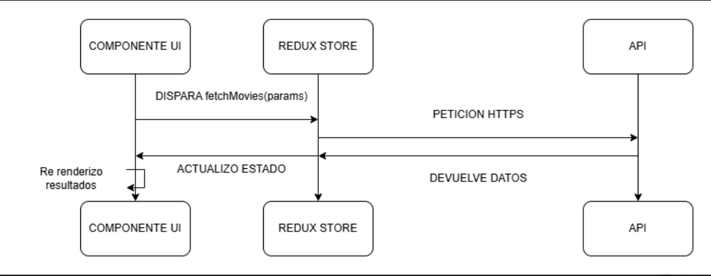

#  Documentación del Sistema: MovieDev App

##  INDEX
1. [Introducción](#introducción)
2. [Arquitectura del Sistema](#arquitectura-del-sistema)
3. [Configuración del Proyecto](#configuración-del-proyecto)
4. [Gestión de Estado con Redux](#gestión-de-estado-con-redux)
5. [Componentes Principales](#componentes-principales)
6. [Flujo de Datos](#flujo-de-datos)
7. [API Externa](#api-externa)
8. [Consideraciones de UX/UI](#consideraciones-de-uxui)
9. [Pruebas y Calidad](#pruebas-y-calidad)
10. [Despliegue](#despliegue)
11. [Mejoras Futuras](#mejoras-futuras)

---

## Introducción
**MovieDev** es una aplicación web que permite buscar y explorar películas y series usando la API pública de **OMDB**.
Está desarrollada con **React.js** y organizada con principios de **Atomic Design** y **código limpio**.

### Características principales
- Búsqueda con filtros (año, tipo, etc.)
- Vista detallada de películas
- Paginación de resultados
- Diseño responsive
- Modo oscuro/claro
- Estado global manejado con **Redux Toolkit**

---

##  Despliegue


### 1) Requisitos
- **Node.js** v16+ (recomendado v18)
- **npm** v8+
- **Git**

Verificar versiones:
```bash
node -v
npm -v
```
### 2) Clonar el repositorio
git clone <REPO_URL>
cd movie-search-app
### Si existe package-lock.json se recomienda:
```bash
npm ci
```


### Caso contrario:
```bash
npm install
```

### 3) Variables de entorno
Crea un archivo `.env` en la raíz del proyecto en mi caso /src y agrega tu clave de API de OMDB:
```plaintext
VITE_OMDB_API_KEY=tu_api_key_aqui
```

### 4) Ejecutar el servidor de desarrollo
```bash
npm run dev
```

##  Arquitectura del Sistema
- src/
- ├── assets/ # Recursos estáticos
- ├── components/ # Componentes reutilizables
- │ ├── layout/ # Estructura de diseño
- │ ├── commin # Componentes comunes
- │ ├── movies/ # Componentes específico de películas
- ├── context/ # Gestión de estado global
- ├── hooks/ # Custom hooks
- ├── pages/ # Componentes de páginas
- ├── styles/ # Estilos globales
- ├── utils/ # Funciones utilitarias
- └── App.js # Componente raíz
- ├── main.js # Punto de entrada de la aplicación donde engloba el componente raíz y el store de Redux

##  Configuración del Proyecto


### Requisitos
- Node.js **v16+**
- npm **v8+**

### Instalación
```bash
git clone [repo-url]
cd movie-search-app
npm install
npm run dev
```

### Estructura de Archivos
```plaintext
src/
├── assets/ # Recursos estáticos (imágenes, iconos)
├── components/ # Componentes reutilizables
│   ├── atoms/ # Componentes UI básicos (botones, inputs)
│   ├── molecules/ # Componentes compuestos (tarjetas, listas)
│   ├── organisms/ # Componentes complejos (barras de navegación, formularios)
│   └── templates/ # Plantillas de páginas (layout principal)
├── context/ # Gestión de estado global (Redux)
├── hooks/ # Custom hooks (lógica reutilizable)
├── pages/ # Componentes de páginas (inicio, búsqueda, detalles)
├── styles/ # Estilos globales (CSS, SASS)
├── utils/ # Funciones utilitarias (formateo, validación)
└── App.js # Componente raíz
```

## Gestión de Estado con Redux
### Configuración de Redux Toolkit
```javascript
import { configureStore } from '@reduxjs/toolkit';
import movieReducer from './features/movieSlice';
export const store = configureStore({
  reducer: {
    movie: movieReducer,
  },
});
```
### Estructura del Slice
```javascript
import { createSlice } from '@reduxjs/toolkit';
const initialState = {
  movies: [],
  loading: false,
  error: null,
};

const movieSlice = createSlice({
  name: "movies",
  initialState: {
    movies: [],
    currentMovie: null,
    loading: false,
    error: null,
    searchTerm: "",
    totalResults: 0,
    page: 1,
    year: "",
    type: "",
  },
  reducers: {
    clearMovies: (state) => {
      state.movies = [];
      state.totalResults = 0;
      state.error = null;
    },
    setSearchParams: (state, action) => {
      state.searchTerm = action.payload.searchTerm;
      state.year = action.payload.year;
      state.type = action.payload.type;
    },
  }})

Luego los reducers se pueden usar en los componentes para actualizar el estado global de la aplicación.

Los Extras Reducers se pueden definir para manejar acciones asíncronas, como la búsqueda de películas desde la API.
```


## Componentes Principales
### SearchBar (Componente de búsqueda)


- Validación en tiempo real
- Filtros avanzados (año, tipo)
- Manejo de errores


### MoviesGrid (Componente de lista de películas)
- Grid responsive con paginación
- Skeletons durante carga
- Estado vacío personalizado


### MovieCard (Componente de tarjeta de película)
- Diseño limpio y minimalista
- Efectos hover y diseño adaptable
- Infrmacion detallada al hacer clic

### MovieDetails (Componente de detalles de película)
- Vista detallada con información completa
- Diseño responsive
- Navegación fácil entre películas

### ThemeToggle (Componente de cambio de tema)
- Cambio entre modo oscuro y claro
- Persistencia del tema en localStorage
- Accesibilidad mejorada

### Pagination (Componente de paginación)
- Navegación entre páginas de resultados
- Botones de navegación y estado activo
- Diseño responsive y accesible


## Flujo de Datos
1. El usuario ingresa un término de búsqueda en el componente `SearchBar`.
2. El componente `SearchBar` despacha una acción para actualizar los parámetros de búsqueda en el estado global.
3. Un thunk asíncrono se activa para buscar películas en la API de OMDB.
4. Los resultados se almacenan en el estado global y se muestran en el componente `MoviesGrid`.
5. Al hacer clic en una película, se navega a la página de detalles y se muestra la información completa en el componente `MovieDetails`.

### imagen de flujo de datos (opcional)


## API Externa
### OMDB API
- Endpoint: `http://www.omdbapi.com/`
- Busqueda de películas: `?s={searchTerm}&page={page}`
- Detalles de película: `?i={imdbID}`

Respuesta de ejemplo:
```javascript
{
      "Title": "The Mysterious Island of Captain Nemo",
      "Year": "1973",
      "imdbID": "tt0068748",
      "Type": "movie",
      "Poster": "https://m.media-amazon.com/images/M/MV5BYTA5MDgxZWItOGRhMi00YjZiLTlkOWQtNjZhZDMzNzhmNTVkXkEyXkFqcGc@._V1_SX300.jpg"
    },
    {
      "Title": "Finding Nemo",
      "Year": "2003",
      "imdbID": "tt0401422",
      "Type": "game",
      "Poster": "https://m.media-amazon.com/images/M/MV5BNGEzMjdiZGEtYzU3ZC00OGFmLWI3NTgtZTcyNTFjYTliNDg5XkEyXkFqcGdeQXVyNjExODE1MDc@._V1_SX300.jpg"
    },
```


## Consideraciones de UX/UI
- Diseño limpio y minimalista
- Accesibilidad mejorada (teclado, lectores de pantalla)
- Feedback visual (cargas, errores)
- Diseño responsive para dispositivos móviles y tablets
- Modo oscuro/claro para mejor experiencia de usuario
- Uso de Skeletons para mejorar la percepción de velocidad de carga

## Sistema de diseño
- Paleta de colores consistente
- Tipografía legible clasica
- Espaciado y alineación automaticos
- Componentes reutilizables siguiendo el desarrollo atomico
- Variables CSS para temas y estilos globales
- iconos con react-icons


## Pruebas y Calidad
 - NO se implementaron pruebas unitarias.


## Despliegue
### Entorno de Producción
- Despliegue en Netlify
- Configuración de variables de entorno para la API
### Pasos de Despliegue
1. Utiliazar una cuenta de Netlify mediante Github para optimizar el despligue
2. Conectar el repositorio de GitHub
3. Configurar las variables de entorno necesarias (API_KEY)
4. Crear un build del proyecto mediante "npm run build"
5. Desplegar el sitio y verificar que todo funcione correctamente.


## Mejoras Futuras
- Implementar pruebas unitarias y de integración
- Agregar peliculas y series a favoritos
- Filtrar peliculas por géneros
- Mediante un Agente IA consultar peliculas relacionadas a un prompt y devolver resultados
- Mostrar futuras peliculas en cartelera
- Comparacion de peliculas mediante puntaje y genero.
- Segun intereses del usuario, sugerir peliculas y series.
